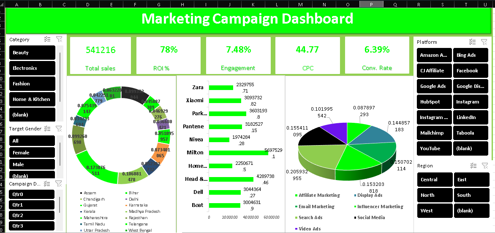

# Marketing Campaign Analytics

Analysis of 150 marketing campaigns across India, examining performance across 
brands, platforms, regions, and target demographics. Built to practice 
end-to-end analytics: data cleaning, pivot tables, and dashboard design in Excel.

# Dashboard

# Dataset

The dataset (`data/marketing_campaign_data_150.xlsx`) contains 150 synthetic 
campaign records with the following fields:

| Column | Description |
|---|---|
| Campaign ID, Campaign Date | Unique identifier and launch date |
| Brand, Category | Brand name and product category |
| Campaign Type, Platform | e.g. Influencer Marketing, Social Media / Instagram, YouTube |
| Objective | Brand Awareness, Lead Generation, Sales Conversion, Customer Retention |
| Target Age Group, Target Gender | Audience targeting |
| City, State, Region | Geographic breakdown |
| Impressions, Clicks, CTR (%) | Reach and engagement funnel |
| Conversion Rate (%), Conversions | Bottom-funnel performance |
| Cost (₹), CPC (₹), CPA (₹) | Spend metrics |
| Revenue (₹), ROI (%) | Return metrics |
| Engagement Rate (%), Status | Additional performance and campaign status |

*Note:* This is a synthetic dataset created for practice — not real brand data.

# *Key Insights
- **Maharashtra generates the highest share of revenue** among all states (17%)
- **Amazon Associates and Bing Ads deliver the strongest ROI** (117%), while Facebook campaigns lag well behind (~34% ROI) — suggesting spend could be reallocated toward affiliate and search channels
- **Sales Conversion campaigns convert best* (7.05% avg conversion rate), while Lead Generation campaigns convert weakest (5.57%) despite being the most-run objective (35 campaigns)
- *South region leads in revenue share* (23.5%), followed closely by North and West (22.5% each); Central region trails significantly (10.6%)
- *Park Avenue has the highest average CTR** among brands, while Zara has the lowest — worth investigating creative/platform mix differences

# Tools Used

- Microsoft Excel — Pivot Tables, Slicers, Charts, Dashboard design

# Repository Structure
